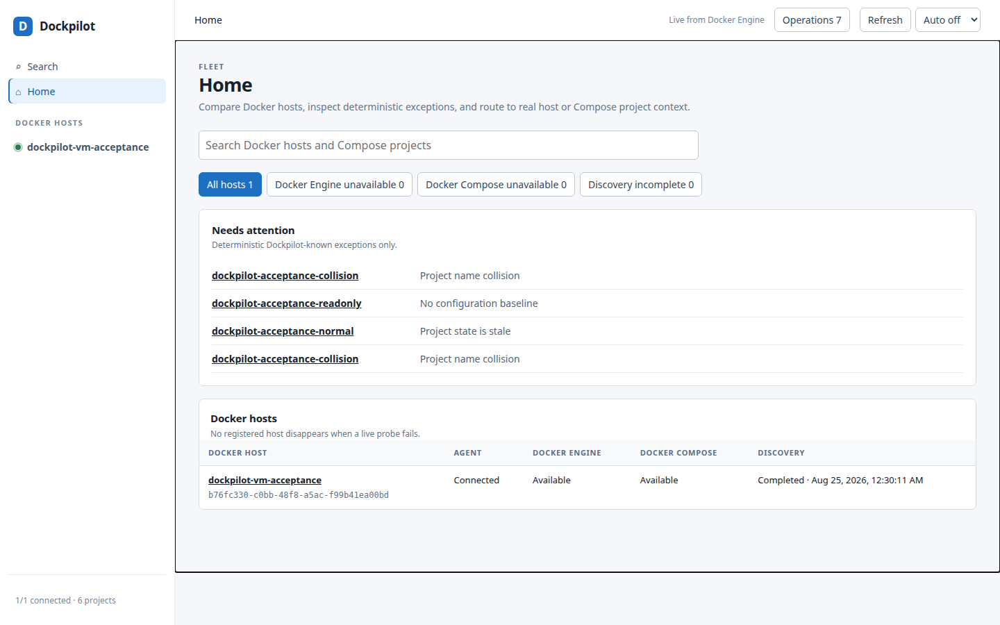

# Dockpilot

<p align="center">
  <strong>A Docker-first control plane for trusted internal networks.</strong>
</p>

<p align="center">
  Manage multiple Linux Docker Engine hosts and Compose projects from one web
  interface—without inbound Agent ports, SSH loops, or a second copy of Docker
  runtime state.
</p>

<p align="center">
  <a href="https://github.com/east-true/dockpilot/actions/workflows/ci.yml"></a>
  <a href="https://github.com/east-true/dockpilot/releases"></a>
  <a href="LICENSE"></a>
  <a href="go.mod"></a>
  <a href="docs/operations/supported-environments.md"></a>
</p>

<p align="center">
  <a href="#docker-feature-coverage">Docker coverage</a> ·
  <a href="#architecture">Architecture</a> ·
  <a href="#security-boundary">Security</a> ·
  <a href="#build-from-source">Build</a> ·
  <a href="docs/README.md">Documentation</a> ·
  <a href="CONTRIBUTING.md">Contributing</a>
</p>



_The current Home screen, captured in Chromium against the disposable
acceptance VM. Every name and identifier shown belongs to a test fixture._

## Why Dockpilot

Dockpilot is for operators who manage a small fleet of trusted Docker hosts and
want one place to inspect state, operate Compose projects, edit configuration,
and understand failures.

- **Docker remains authoritative.** Current Containers, Images, Networks,
  Volumes, health, and resource use come from Docker Engine—not a replicated
  Dockpilot inventory.
- **Agents dial out.** Each host opens one reverse gRPC connection to the
  Server. Hosts behind NAT, firewalls, or changing addresses need no inbound
  Agent port.
- **Mutations are bounded.** Operations use fixed arguments, project-scoped
  locks, idempotency, timeouts, cancellation semantics, and explicit refusal
  reasons.
- **Missing facts stay missing.** Stale, partial, offline, unavailable, and
  unknown states are presented as such instead of being guessed.
- **Configuration stays on the host.** Compose and `.env` contents are handled
  by the Agent and are not stored in the Server database.

## Docker feature coverage

Dockpilot is intentionally smaller than the Docker CLI. “Not provided” usually
marks a safety or product boundary, not an unfinished button.

| Docker area | Dockpilot v1 | Included | Not provided |
|---|---|---|---|
| Docker hosts | **Inspect** | Engine version and API, capacity, storage/logging/cgroup/runtime details, capabilities, and Compose discovery state | Host package, process, filesystem, network, or OS management |
| [Containers](https://docs.docker.com/reference/cli/docker/container/) | **Inspect + control** | List, search, Inspect details, state/health, ports, mounts, networks, logs, stats, start, stop, restart, and remove one selected Container | `exec`, attach, shell/terminal, arbitrary `docker run`, copy, rename, update, export, or commit |
| [Images](https://docs.docker.com/reference/cli/docker/image/) | **Inspect + Compose Pull** | List, tags/digests, size, creation time, Container references, Inspect details, and Pull for Services with a declared Image | Build, push, tag, import/load/save, remove, prune, registry credential management, or disk-usage analysis |
| [Networks](https://docs.docker.com/reference/cli/docker/network/) | **Read-only** | List, driver/scope/options, IPAM, and attached Container details | Create, connect, disconnect, remove, or prune |
| [Volumes](https://docs.docker.com/reference/cli/docker/volume/) | **Read-only** | List, driver/scope/options, labels, and Container references | Create, remove, prune, content browsing, or volume-data backup |
| Docker Compose projects | **Discover + control** | Label and filesystem discovery; effective model; project Pull, Up, Down, Start, Stop, and Restart; Service Pull, Up, Start, Stop, and Restart where valid | Arbitrary Compose flags, `run`, `exec`, `watch`, `publish`, `cp`, scale controls, or Project Lock force-release |
| Compose Image build | **Not provided** | `build:` metadata is visible; Image-backed Services remain operable without building | Image builds, build fallback, BuildKit controls, build args, Dockerfile editing, or CI pipeline behavior |
| [Container logs](https://docs.docker.com/reference/cli/docker/container/logs/) | **Live only** | Project, Service, and Container selection; tail/time filters; bounded browser search; dropped-byte reporting | Log history, persistence, host-wide log aggregation, or a Loki replacement |
| [Container stats](https://docs.docker.com/reference/cli/docker/container/stats/) | **Live only** | Viewer-scoped CPU, memory, network, block I/O, state, health, hierarchy, and top Containers | Metrics history, alerting, host OS metrics, Prometheus storage, or a Grafana replacement |
| Compose and `.env` files | **Bounded management** | Allowlisted reads and edits, secret reveal, validation, atomic replacement, SHA conflict detection, and pre-write snapshots | Arbitrary host filesystem access, directory editing, symlink traversal, or raw Container environment reveal |
| Configuration backup | **Compose configuration only** | Agent-local project archives, per-file SHA-256 manifests, retention, restore lock, transaction journal, and recovery | Named Volume data, bind-mounted directory data, application-aware database backups, or remote backup storage |
| Audit and operations | **Supported** | Managed operations, observed Docker/Compose changes, bounded output tails, cancellation, durable Agent WAL, Server archive, and explicit coverage gaps | General OS audit, shell history, external SIEM export, or automatic remediation |
| Orchestration | **Docker Engine + Compose only** | Multiple standalone Linux Docker hosts | Docker Swarm control, Kubernetes, ACI, or cross-host scheduling |
| Engine connection | **Local socket only** | Container Agent with the local Docker socket and identical-path project-root mounts | Remote `DOCKER_HOST`, socket proxies, Docker Desktop, or rootless nonstandard sockets |

### Compose never builds Images

Dockpilot v1 executes Compose only when the effective Service model can be
satisfied from declared Images. It never builds, never falls back to a build,
and never silently skips a build-required Service.

```text
Pull: docker compose ... pull <explicit image-backed Service list>
Up:   docker compose ... up --detach --no-build
```

- `image:` → Pull and Up are available.
- `image:` + `build:` → the declared Image may be pulled and started; build
  metadata remains read-only.
- `build:` without `image:` → Service Pull and Up are unavailable, and the
  whole-project Up is blocked.
- `image:` + `build:` + `pull_policy: build` → Up is blocked because the
  Compose model explicitly requires a build.

This follows Docker Compose's documented
[`pull`](https://docs.docker.com/reference/cli/docker/compose/pull/) and
[`up --no-build`](https://docs.docker.com/reference/cli/docker/compose/up/)
semantics while adding Dockpilot's stricter no-build product boundary.

## Architecture

```text
                                 HTTPS
  Browser ───────────────────────────────────▶ Dockpilot Server
                                               registration
                                               operation index
                                               canonical Audit archive
                                                        ▲
                                                        │ one Agent-initiated
                                                        │ reverse gRPC session
                                                        │
                                               Dockpilot Agent
                                               Docker socket
                                               Compose project roots
                                                        │
                                                        ▼
                                                  Docker Engine
```

Run one central Server and one Agent on each managed Docker host. The Server
accepts many outbound Agent sessions.

| Fact or action | Authority |
|---|---|
| Current Container, Image, Network, Volume, health, and stats state | Docker Engine |
| Compose configuration content | Host filesystem |
| Command execution, cancellation, and project locks | Agent |
| Synchronized Audit history and coverage ledger | Server |

The Server does not become a second Docker state database, and a browser
disconnect does not cancel an operation already accepted by an Agent.

## Security boundary

> [!WARNING]
> **Dockpilot v1 has no browser authentication, user accounts, or RBAC.** Anyone
> who can reach the Server UI can control every connected Docker host.
>
> The Server binds to `127.0.0.1` by default. Keep it on loopback, use a private
> tunnel, or put every browser-facing route behind an authenticating reverse
> proxy. Publishing `8080` on all host interfaces is not a safe deployment.

The safe host-side publication shape is intentionally explicit:

```sh
docker run ... -p 127.0.0.1:8080:8080 "$server_image"
```

The ellipsis is not a complete install command. The
[installation guide](docs/operations/install.md) verifies the signed release,
sets `$server_image` to its exact digest from `release-images.json`, and
supplies the required state, TLS, registration, and Agent arguments.

The Agent necessarily has powerful Docker access. Dockpilot reduces that risk
with self-protection, fixed operation kinds, identical-path validation, safe
file allowlists, project locks, bounded storage, and fail-closed capability
checks; it does not turn Docker socket access into an unprivileged boundary.

Read [SECURITY.md](SECURITY.md) and
[supported environments](docs/operations/supported-environments.md) before
deploying.

## Build from source

The Go version is declared in [`go.mod`](go.mod).

```sh
git clone https://github.com/east-true/dockpilot.git
cd dockpilot
go build ./cmd/dockpilot
go test ./...
```

The resulting binary contains both `server` and `agent` modes and embeds the
production web UI.

> [!IMPORTANT]
> [`v0.0.0`](https://github.com/east-true/dockpilot/releases/tag/v0.0.0) is the
> first source-only pre-release. GitHub provides source archives for the tag;
> the release does not publish signed Server/Agent images or prebuilt binaries.
> The Image-bearing release workflow is prepared for a later SemVer tag; it
> does not retroactively add Images to `v0.0.0`.

For image construction and reproducibility evidence, see
[v1 distribution](docs/release/distribution.md). For the complete container
deployment procedure, including TLS, Join Tokens, Docker socket permissions,
identical-path mounts, read-only roots, and Agent upgrades, see
[installation](docs/operations/install.md).

## Documentation

Start at the **[documentation index](docs/README.md)**.

| Audience | Start here |
|---|---|
| New operator | [Concepts](docs/concepts.md) → [Supported environments](docs/operations/supported-environments.md) → [Installation](docs/operations/install.md) |
| Existing operator | [Configuration](docs/operations/configuration.md), [Identity recovery](docs/operations/recovery.md), [Degraded storage](docs/operations/degraded-storage.md) |
| API integrator | [HTTP API](docs/operations/api.md) and [v1 interface freeze](docs/interface-freeze.md) |
| UI maintainer | [Product and UI contracts](docs/design/README.md) and [Web UI acceptance](docs/design/web-ui-acceptance.md) |
| Release reviewer | [Release evidence](docs/release/README.md) and individual gate records |
| Contributor | [CONTRIBUTING.md](CONTRIBUTING.md) and the authoritative [architecture record](docs/architecture.md) |

## Development and verification

Go checks:

```sh
go vet ./...
go test ./...
go test -race ./...

for check in scripts/verify-*.sh; do
  "$check"
done
```

Web UI and documentation checks:

```sh
npm ci
npm run test:ui:install
npm run check:format
npm run check:docs
npm run test:ui
```

The Playwright suite covers 1440, 1280, 1024, 768, and 375 pixel viewports.
`npm run test:ui:headed` uses a visible browser,
`npm run test:ui:open` opens Playwright's interactive runner, and
`npm run test:ui:report` opens the generated report. Set
`PLAYWRIGHT_TEST_BASE_URL` to exercise an already running Dockpilot Server.

The release evidence records the distinction between implementation complete,
validated defaults, and release-candidate work. In particular, the one-hour
soak passed while the longer soak stages remain outstanding. See
[release evidence](docs/release/README.md) for the exact revisions,
environments, and limitations.

## Contributing and support

- Read [CONTRIBUTING.md](CONTRIBUTING.md) before proposing behavior. Features
  classified as `FUTURE` or `DO NOT BUILD` require an architecture decision
  before implementation.
- Use [GitHub Issues](https://github.com/east-true/dockpilot/issues) for bugs and
  feature discussions. Include the Dockpilot revision, kernel, Docker Engine,
  Compose version, Agent root mode, and exact refusal text.
- Report vulnerabilities privately using [SECURITY.md](SECURITY.md).

## License

Apache License 2.0. See [LICENSE](LICENSE) and [NOTICE](NOTICE).

The embedded production frontend is first-party and has no external runtime
assets. Playwright is a development-only dependency. Go dependency license
material is generated from pinned modules with
[`scripts/generate-license-inventory.sh`](scripts/generate-license-inventory.sh),
while programs bundled in the Agent image are covered by
[`distribution/IMAGE-LICENSES.md`](distribution/IMAGE-LICENSES.md).

Dockpilot is not affiliated with or endorsed by Docker, Inc. Docker and the
Docker logo are trademarks or registered trademarks of Docker, Inc.
